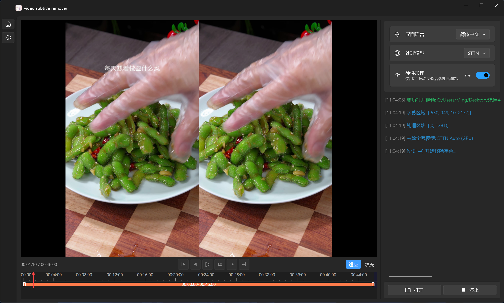

简体中文 | [English](README_en.md)

<div align="center">
  
</div>

## 项目简介


Video-subtitle-remover (VSR) 是一款基于AI技术，将视频中的硬字幕去除的软件。
主要实现了以下功能：
- **无损分辨率**将视频中的硬字幕去除，生成去除字幕后的文件
- 通过超强AI算法模型，对去除字幕文本的区域进行填充
- 支持自定义字幕位置，仅去除定义位置中的字幕
- 支持多选图片批量去除水印文本



**使用说明：**
- 直接下载压缩包解压运行，如果不能运行再按照下面的教程，尝试源码安装环境运行

## 源码使用说明

#### 1. 安装 Python

请确保您已经安装了 Python 3.12+。

- Windows 用户可以前往 [Python 官网](https://www.python.org/downloads/windows/) 下载并安装 Python。
- MacOS 用户可以使用 Homebrew 安装：
  ```shell
  brew install python@3.12
  ```
- Linux 用户可以使用包管理器安装，例如 Ubuntu/Debian：
  ```shell
  sudo apt update && sudo apt install python3.12 python3.12-venv python3.12-dev
  ```

#### 2. 安装依赖文件

请使用虚拟环境来管理项目依赖，避免与系统环境冲突。

（1）创建虚拟环境并激活
```shell
python -m venv videoEnv
```

- Windows：
```shell
videoEnv\\Scripts\\activate
```
- MacOS/Linux：
```shell
source videoEnv/bin/activate
```

#### 3. 切换到项目目录

```shell
cd <源码所在目录>
```

#### 4. 安装合适的运行环境

本项目支持 CUDA (NVIDIA显卡加速)、CPU (无 GPU)、 DirectML (AMD、Intel等GPU/APU加速) 和 macOS (Apple Silicon) 四种运行模式。

##### (1) CUDA（NVIDIA 显卡用户）

> 请确保您的 NVIDIA 显卡驱动支持所选 CUDA 版本。

- 安装 CUDA（推荐 CUDA 11.8）：
  - Windows：[CUDA 11.8 下载](https://developer.download.nvidia.com/compute/cuda/11.8.0/local_installers/cuda_11.8.0_522.06_windows.exe)
  - Linux：
    ```shell
    wget https://developer.download.nvidia.com/compute/cuda/11.8.0/local_installers/cuda_11.8.0_520.61.05_linux.run
    sudo sh cuda_11.8.0_520.61.05_linux.run
    ```

- 安装 cuDNN（CUDA 11.8 对应 cuDNN 8.6.0）：
  - [Windows cuDNN 8.6.0 下载](https://developer.download.nvidia.cn/compute/redist/cudnn/v8.6.0/local_installers/11.8/cudnn-windows-x86_64-8.6.0.163_cuda11-archive.zip)
  - [Linux cuDNN 8.6.0 下载](https://developer.download.nvidia.cn/compute/redist/cudnn/v8.6.0/local_installers/11.8/cudnn-linux-x86_64-8.6.0.163_cuda11-archive.tar.xz)
  - 安装方法请参考 NVIDIA 官方文档。

- 安装 PaddlePaddle GPU 版本（CUDA 11.8）：
  ```shell
  pip install paddlepaddle-gpu==3.0.0 -i https://www.paddlepaddle.org.cn/packages/stable/cu118/
  ```
- 安装 Torch GPU 版本（CUDA 11.8）：
  ```shell
  pip install torch==2.7.0 torchvision==0.22.0 --index-url https://download.pytorch.org/whl/cu118
  ```

- 安装其他依赖
  ```shell
  pip install -r requirements.txt
  ```

##### (2) DirectML（AMD、Intel等GPU/APU加速卡用户）

- 适用于 Windows 设备的 AMD/NVIDIA/Intel GPU。
  ```shell
  pip install paddlepaddle==3.0.0 -i https://www.paddlepaddle.org.cn/packages/stable/cpu/
  pip install -r requirements.txt
  pip install torch_directml==0.2.5.dev240914
  ```

##### (3) CPU 运行（无 GPU 加速）

- 适用于没有 GPU 或不希望使用 GPU 的情况。
  ```shell
  pip install paddlepaddle==3.0.0 -i https://www.paddlepaddle.org.cn/packages/stable/cpu/
  pip install torch==2.7.0 torchvision==0.22.0
  pip install -r requirements.txt
  ```

##### (4) macOS 运行 (Apple Silicon)
- 适用于 macOS (Apple Silicon) 设备
- macOS (Intel) 请使用CPU，强行使用GPU只会更慢
  ```shell
  pip install paddlepaddle==3.0.0 -i https://www.paddlepaddle.org.cn/packages/stable/cpu/
  pip install torch==2.7.0 torchvision==0.22.0
  pip install -r requirements.txt
  ```

#### 5. 运行程序

- 运行图形化界面
```shell
python gui.py
```

## 常见问题

1. 视频去除效果不好怎么办

修改 `config/config.json` 中的参数或通过高级设置调整：

| 参数 | 说明 |
|------|------|
| SttnNeighborStride | 相邻帧数，调大效果变好但显存占用增加 |
| SttnReferenceLength | 参考帧长度，调大效果变好但显存占用增加 |
| SttnMaxLoadNum | 最大同时处理的帧数量 |

## 致谢

本程序使用了 [YaoFANGUK/video-subtitle-remover](https://github.com/YaoFANGUK/video-subtitle-remover) 的部分代码，感谢原作者的贡献。
